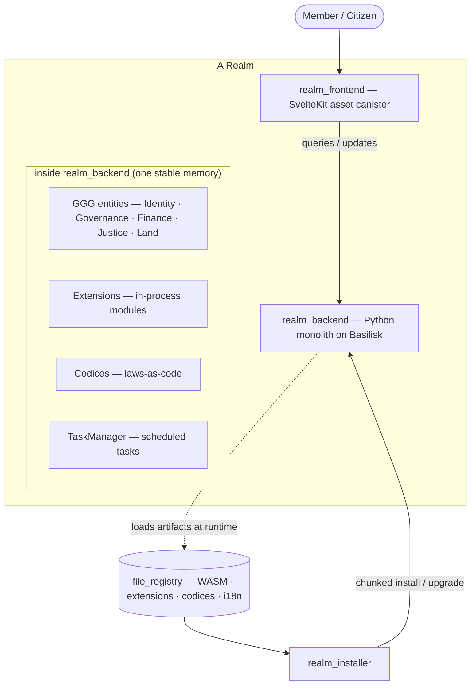
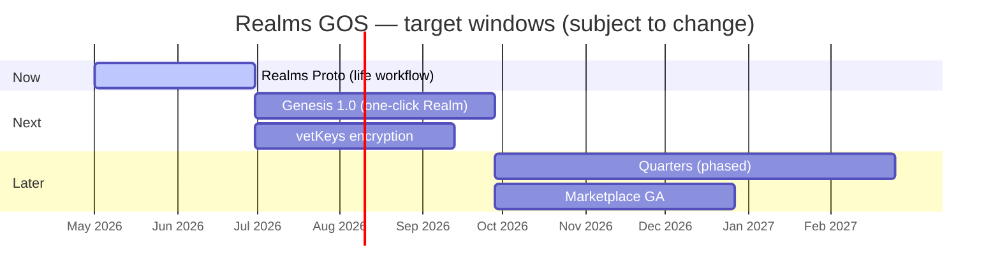

# Realms GOS — Roadmap & Design

> **Living document.** This is the public map of where Realms GOS is going and why.
> It changes as the project and its environment change. For the authoritative, detailed
> breakdown of any item, follow the linked GitHub Epic.
>
> **Last updated:** 2026-05-29 · **Maintainer:** Jose ([@smart-social-contracts](https://github.com/smart-social-contracts))

---

## Vision

**Smart social contracts.** Realms GOS (Governance Operating System) is a platform for
building and running governance systems on the [Internet Computer](https://internetcomputer.org)
— where the rules a community lives by are written, read, voted on, and executed as
**laws-as-code** (codices), in plain Python, fully on-chain.

A *Realm* is a self-contained governance space: its members, treasury, justice, land,
and rules live together in one tamper-evident system that the community controls and can
always leave.

---

## Principles & Non-Goals

These guide every decision on this roadmap.

1. **Vision-led, not platform-led.** We build toward smart social contracts. We adapt to
   the Internet Computer's evolution (cloud engines, subnets, new CLI, vetKeys, …)
   **opportunistically, when it clearly serves the product** — never by reorganizing the
   project around any single platform feature or partner's go-to-market.
2. **Shipping beats positioning.** Real Realms with real members are the validation that
   matters. We optimize for going live.
3. **Laws must be readable.** Governance rules are Python because communities, not just
   engineers, need to read and reason about the rules that bind them.
4. **Frictionless exit.** Opting out — of a federation, a quarter, the platform — must
   always be possible with no data hostage-taking. Sovereignty is the default.
5. **Self-contained Realms.** A Realm should keep working on its own. External dependencies
   are conveniences, never load-bearing.

**Non-goals (for now):** chasing a specific partner/customer go-to-market; re-architecting
around microservice-per-canister patterns; supporting chains other than ICP.

---

## Current Status: Genesis Alpha

Realms GOS is in the **alpha** stage of the **1.0 "Genesis"** release. Features are still
being implemented and the system is experimental. Live sandbox: [demo.realmsgos.org](https://demo.realmsgos.org).

---

## System at a Glance

A Realm is a **Python monolith** (`realm_backend`) running on the Basilisk CDK, with a
static frontend and an artifact registry. Extensions and codices run *inside* the backend,
sharing one stable memory — so governance operations over the entity graph stay atomic.

Deployment supports two modes that produce the same end-user experience: **Bundled**
(everything baked into the WASM — default, simplest) and **Layered** (base WASM +
runtime-loaded extensions/codices from `file_registry` — for long-lived fleets).

---

## Roadmap

Organized by horizon. Items move left-to-right as they ship. Dates are in the timeline
below and are **intentions, not commitments**.

### 🟢 Now — in progress

#### Realms Proto — basic life workflow
A working showcase of the full governance lifecycle (not yet a full MVP).
- **Why:** prove the end-to-end "life of a Realm" loop works on-chain.
- **Scope:** join a Realm (buy land NFT / pay membership) → create proposals → vote →
  automated tax collection. Extensions: voting, passport verification, land registry,
  member dashboard, vault, task monitor, notifications. Codices: governance automation,
  tax collection, token transfer, user registration.
- **Done when:** a fresh user can complete the whole loop on [demo.realmsgos.org](https://demo.realmsgos.org)
  without manual intervention.
- **Status:** in progress · 📋 [Epic #104](https://github.com/smart-social-contracts/realms/issues/104)

### 🟡 Next — committed, not yet started

#### Genesis 1.0 — one-click Realm creation
Anyone can create a live Realm in a few clicks. No code, no blockchain knowledge.
- **Why:** turn Realms from "a thing we deploy" into "a thing anyone can launch."
- **Scope:** template wizard (Syntropia · Agora · Dominion · blank) → Internet Identity
  sign-in → credit-card payment ($1 = 1 credit) → provisioning backend → cycles/credit
  tracking → founder auto-registration.
- **Done when:** a non-technical user goes from landing page to a live, self-owned Realm
  unaided.
- **Status:** planned · 📋 [Epic #98](https://github.com/smart-social-contracts/realms/issues/98)

#### vetKeys encryption
End-to-end encryption using the IC's vetKeys (Verifiably Encrypted Threshold Keys).
- **Why:** private data handling without external key management — needed for real
  governance use (sealed votes, confidential cases, member PII).
- **Scope:** field-level encryption for GGG entities, per-member keys, group access.
- **Done when:** an extension can store and selectively share encrypted data with no
  off-chain key custody.
- **Status:** planned <!-- maintainer: edit — confirm scope/order -->

### 🔵 Later — directional, scope may change

#### Quarters — horizontal scalability
Federated, autonomous realm backends so a Realm can scale beyond one canister.
- **Why:** remove the single-canister ceiling for large Realms while keeping exit frictionless.
- **Scope (phased):** ① core loop — `home_quarter` on users, capital coordination,
  auto-routing; ② federation — guest access, peer gossip, secede/join; ③ automation —
  auto-provision quarters at capacity. Each quarter *is* a full Realm and can secede with
  zero data migration.
- **Done when:** a Realm can split/merge quarters by vote, and any quarter can secede
  intact. See [QUARTERS.md](./QUARTERS.md) for the full design.
- **Status:** designed, not started · 📋 [Epic #143](https://github.com/smart-social-contracts/realms/issues/143)

#### Marketplace
Discover, publish, and install extensions and codices.
- **Why:** let the community extend Realms without forking.
- **Scope:** listings, ranking, purchases/licenses, verification status; artifacts in
  `file_registry`. ▢ decide Next vs Later. <!-- maintainer: edit -->
- **Status:** partial (canisters exist) <!-- maintainer: edit -->

### ⚙️ Foundations — continuous

- **Basilisk interpreter** — CPython-on-WASM CDK; replaced the deprecated Kybra toolchain.
  Ongoing performance and compatibility work. *(done, maintained)*
- **ICP platform adaptation** — opportunistic: migrate off `dfx` to ICP CLI; adopt
  application bundling / sync plugins where they reduce our own maintenance. *(as it serves us)*
- **Docs & developer experience** — reference docs, extension authoring guide, examples.

---

## Target Timeline

> ⚠️ **These dates are intentions, not commitments.** They reflect current intent and will
> move. The horizon labels (Now / Next / Later) above are the reliable signal.

<!-- maintainer: edit dates above to reflect your real intent -->

---

## How to follow

- ⭐ **Watch / star** the [repo](https://github.com/smart-social-contracts/realms) for releases.
- 📋 **Epics** track detailed progress: [#104](https://github.com/smart-social-contracts/realms/issues/104),
  [#98](https://github.com/smart-social-contracts/realms/issues/98),
  [#143](https://github.com/smart-social-contracts/realms/issues/143).
- 🧪 **Try it:** [demo.realmsgos.org](https://demo.realmsgos.org).
- 💬 **Contribute:** see [extensions/CONTRIBUTING.md](./extensions/CONTRIBUTING.md) and open an issue/PR.

---

## Roadmap changelog

Changes to *this document* (not the code) — so followers can see how the plan evolves.

| Date | Change |
|------|--------|
| 2026-05-29 | Restructured into a living roadmap: vision, principles & non-goals, system diagram, Now/Next/Later milestones with mini-specs, target timeline. |
