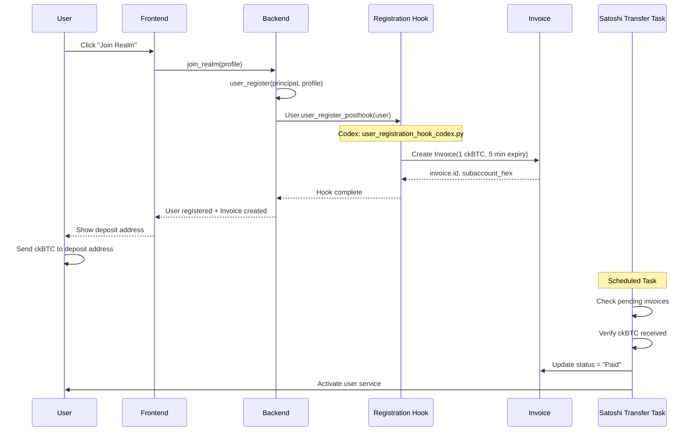
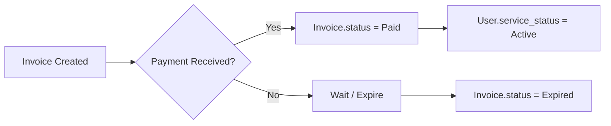

# Demo Mundus Example

This document describes the demo mundus deployment, showcasing a complete multi-realm ecosystem with 3 interconnected realms and a central registry.

---

## Overview

The demo mundus demonstrates key Realms platform capabilities:

- **Multi-Realm Architecture**: 3 independent realms sharing a common registry
- **Custom Branding**: Per-realm logo customization
- **Entity Method Overrides**: Custom behavior via manifest configuration
- **Lifecycle Hooks**: User registration hooks with codex implementations
- **Demo Data**: Automatically generated users, organizations, and transactions

---

## Quick Start

```bash
# Create and deploy the complete demo mundus
realms mundus create --deploy

# Access the realms
# Realm 1: http://<realm1_frontend_id>.localhost:8000
# Realm 2: http://<realm2_frontend_id>.localhost:8000
# Realm 3: http://<realm3_frontend_id>.localhost:8000
# Registry: http://<registry_frontend_id>.localhost:8000
```

---

## User Registration Flow

The following diagram shows the complete user onboarding flow with invoice creation and payment processing:



---

## Key Features

### 1. Custom Realm Logos

Each realm can have its own branding. The logo is defined in the manifest and copied to the frontend during deployment.

**Configuration**: [`examples/demo/realm1/manifest.json`](../examples/demo/realm1/manifest.json)
```json
{
  "name": "Realm 1",
  "logo": "logo.svg"
}
```

### 2. Demo Data Upload

The [`3-upload-data.sh`](../.realms/realm_Generated_Demo_Realm_20251205_212402/scripts/3-upload-data.sh) script imports initial realm data:
- **Users**: Generated citizens with profiles
- **Organizations**: Businesses and government entities
- **Transactions**: Financial transfer history
- **Codexes**: Automation scripts for governance

---

## Entity Method Overrides

### Vault Extension Overrides

The Vault extension overrides core GGG entity methods to integrate with the ckBTC blockchain.

**Configuration**: [`extensions/vault/manifest.json`](../extensions/vault/manifest.json)
```json
{
  "entity_method_overrides": [
    {
      "entity": "Transfer",
      "method": "execute",
      "implementation": "methods.execute_transfer",
      "description": "Execute external blockchain transfer via vault"
    },
    {
      "entity": "Balance",
      "method": "refresh",
      "type": "classmethod",
      "implementation": "methods.refresh_balance",
      "description": "Sync all balances with vault state"
    }
  ]
}
```

**Implementation**: [`extensions/vault/backend/methods.py`](../extensions/vault/backend/methods.py)
```python
def execute_transfer(self) -> Async[dict]:
    """Execute transfer via blockchain integration."""
    logger.info("Executing transfer...")
    vault_response = yield _transfer(self.principal_to, self.amount)
    return vault_response

def refresh_balance(cls, force: bool = False) -> Async[dict]:
    """Sync all balances with blockchain state."""
    logger.info("Refreshing all balances from vault...")
    vault_response = yield _refresh(force)
    return vault_response
```

These overrides enable:
- `Transfer.execute()` → Routes through Vault's blockchain transfer logic
- `Balance.refresh()` → Syncs all balances with on-chain ckBTC state

---

### User Registration Hook

When a new user registers, a custom hook creates a welcome invoice for ckBTC payment.

**Configuration**: [`examples/demo/realm1/manifest.json`](../examples/demo/realm1/manifest.json)
```json
{
  "entity_method_overrides": [
    {
      "entity": "User",
      "method": "user_register_posthook",
      "type": "staticmethod",
      "implementation": "Codex.user_registration_hook_codex.user_register_posthook",
      "description": "Custom post-registration hook for new users"
    }
  ]
}
```

**Implementation**: [`examples/demo/realm1/user_registration_hook_codex.py`](../examples/demo/realm1/user_registration_hook_codex.py)
```python
def user_register_posthook(user):
    """Custom user registration hook - creates welcome invoice."""
    # Calculate expiry time (5 minutes from now)
    expiry_time = datetime.now() + timedelta(minutes=5)
    
    # Create 1 ckBTC invoice for the new user
    invoice = Invoice(
        amount=1.0,  # 1 ckBTC
        currency="ckBTC",
        due_date=expiry_time.isoformat(),
        status="Pending",
        user=user,
        metadata="Welcome bonus - 1 ckBTC invoice"
    )
    
    ic.print(f"✅ Created welcome invoice {invoice.id} for user {user.id}")
```

**Core Hook Definition**: [`src/realm_backend/ggg/user.py`](../src/realm_backend/ggg/user.py)
```python
@staticmethod
def user_register_posthook(user: "User"):
    """Hook called after user registration. Can be overridden by extensions."""
    logger.info(f"Hook called after user registration.")
    return
```

---

### Invoice Payment Hook (Planned)

When an invoice is paid, the user's service status will be activated:



*This feature is planned for future implementation via an `Invoice.on_paid_posthook`.*

---

## Architecture Summary

| Component | Location | Description |
|-----------|----------|-------------|
| **Vault Extension** | [`extensions/vault/`](../extensions/vault/) | Overrides treasury methods for blockchain transfers |
| **Registration Hook Codex** | [`examples/demo/realm1/user_registration_hook_codex.py`](../examples/demo/realm1/user_registration_hook_codex.py) | Custom logic executed after user registration |
| **Realm Manifest** | [`examples/demo/realm1/manifest.json`](../examples/demo/realm1/manifest.json) | Configures entity method overrides |
| **User Entity** | [`src/realm_backend/ggg/user.py`](../src/realm_backend/ggg/user.py) | Core user entity with hook extension points |
| **Demo Folder** | [`examples/demo/`](../examples/demo/) | Complete mundus configuration |

---

## Override Implementation Patterns

### Pattern 1: Extension-Based Overrides

Code lives in the **extension package**:
- Defined in extension's [`manifest.json`](../extensions/vault/manifest.json)
- Implementation in [`extensions/vault/backend/methods.py`](../extensions/vault/backend/methods.py)
- Installed with the extension via `1-install-extensions.sh`

### Pattern 2: Codex-Based Overrides

Code lives in **realm-specific codexes**:
- Defined in realm's [`manifest.json`](../examples/demo/realm1/manifest.json)
- Implementation in [`*_codex.py`](../examples/demo/realm1/user_registration_hook_codex.py) files
- Deployed with realm data via `3-upload-data.sh`
- Referenced as `Codex.{codex_name}.{function_name}`

---

## Summary

1. **Vault extension** overrides `Transfer.execute()` and `Balance.refresh()` for blockchain integration. The code lives in the [vault extension repository](../extensions/vault/).

2. **User registration hook** is configured via the realm's manifest and implemented in a codex that creates an invoice for new users. This code is deployed with the realm.

3. **Invoice payment hook** (planned) will update user service status when invoices are paid.

**Key Insight**: The `manifest.json` is the configuration layer for overrides. The actual implementation can be either:
- In an **extension package** (shared across realms)
- In a **realm-specific codex** (unique to one realm)

---

## See Also

- [Deployment Guide](./DEPLOYMENT_GUIDE.md) - Deployment scripts overview
- [Entity Method Overrides](./ENTITY_METHOD_OVERRIDES.md) - Technical reference
- [Demo Folder README](../examples/demo/README.md) - Configuration structure
