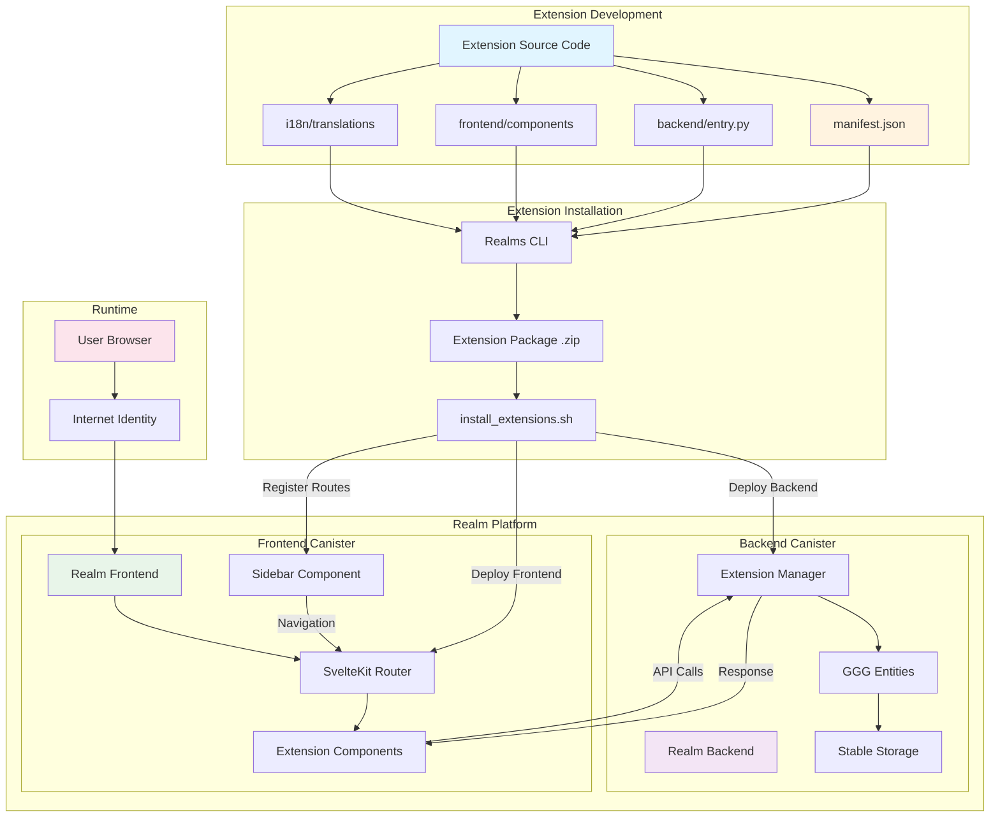
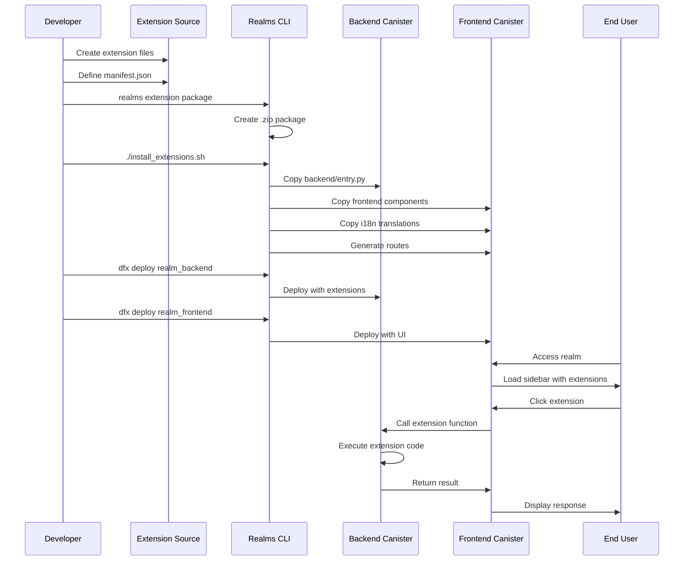
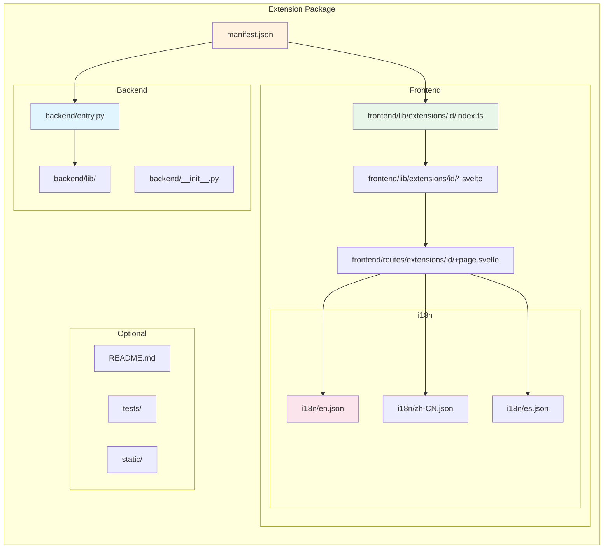
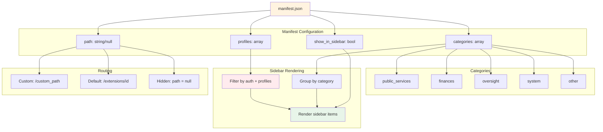
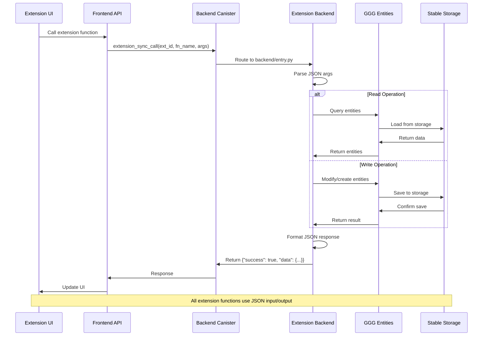
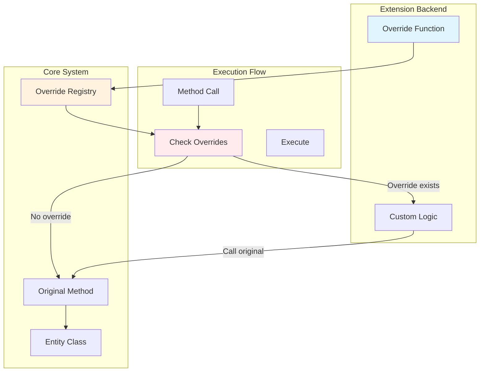

# Extension Architecture

## System Overview



## Extension Lifecycle



## Extension Structure



## Extension Categories & Routing



## Extension API Call Flow



## Method Override System



## Extension Permission Model

```mermaid
graph TD
    USER[User Request]
    AUTH{Authenticated?}
    PROF{Has Profile?}
    PERM{Has Permission?}
    
    EXT_PUB[Public Extension]
    EXT_MEM[Member Extension]
    EXT_ADM[Admin Extension]
    
    ALLOW[Allow Access]
    DENY[Deny Access]
    
    USER --> AUTH
    
    AUTH --> |No| EXT_PUB
    AUTH --> |Yes| PROF
    
    EXT_PUB --> ALLOW
    
    PROF --> |profiles: []| ALLOW
    PROF --> |profiles: [member]| PERM
    PROF --> |profiles: [admin]| PERM
    
    PERM --> |Match| ALLOW
    PERM --> |No Match| DENY
    
    style EXT_PUB fill:#e8f5e9
    style EXT_MEM fill:#fff3e0
    style EXT_ADM fill:#ffebee
    style ALLOW fill:#c8e6c9
    style DENY fill:#ffcdd2
```

## Extension Development Workflow

```mermaid
graph LR
    subgraph "1. Create"
        CREATE[Create Extension]
        STRUCT[Setup Structure]
        MANIFEST[Write manifest.json]
    end
    
    subgraph "2. Develop"
        BACKEND[Implement Backend]
        FRONTEND[Build Frontend]
        I18N[Add Translations]
        TEST[Write Tests]
    end
    
    subgraph "3. Test"
        LOCAL[Install Locally]
        DEPLOY[Deploy to Test Realm]
        DEBUG[Debug & Iterate]
    end
    
    subgraph "4. Package"
        PKG[Package Extension]
        DOC[Write Documentation]
        VER[Version & Tag]
    end
    
    subgraph "5. Distribute"
        RELEASE[Create Release]
        PUBLISH[Publish Package]
        MARKET[Add to Marketplace]
    end
    
    CREATE --> STRUCT
    STRUCT --> MANIFEST
    MANIFEST --> BACKEND
    
    BACKEND --> FRONTEND
    FRONTEND --> I18N
    I18N --> TEST
    
    TEST --> LOCAL
    LOCAL --> DEPLOY
    DEPLOY --> DEBUG
    DEBUG --> |Iterate| BACKEND
    
    DEBUG --> |Ready| PKG
    PKG --> DOC
    DOC --> VER
    
    VER --> RELEASE
    RELEASE --> PUBLISH
    PUBLISH --> MARKET
    
    style CREATE fill:#e1f5ff
    style BACKEND fill:#f3e5f5
    style LOCAL fill:#fff3e0
    style PKG fill:#e8f5e9
    style MARKET fill:#fce4ec
```



## Key Concepts

### Extension Types
- **Public Extensions**: Accessible to all users (no profiles required)
- **Member Extensions**: Require authentication and specific profiles
- **Admin Extensions**: Restricted to admin profile only
- **System Extensions**: Core platform functionality

### Extension Categories
- **public_services**: Government services, citizen management
- **finances**: Treasury, payments, trading
- **oversight**: Dashboards, metrics, monitoring
- **system**: Admin tools, configuration
- **other**: General utilities

### Integration Points
1. **Backend Integration**: Extension functions callable via `extension_sync_call` or `extension_async_call`
2. **Frontend Integration**: Svelte components with routing and sidebar integration
3. **Entity Access**: Full access to GGG entity system
4. **Method Overrides**: Can intercept and modify entity method behavior
5. **i18n Support**: Multi-language translation system
6. **Storage**: Share realm's stable storage for persistence

### Security Model
- **Profile-based access control**: Extensions declare required profiles
- **Manifest validation**: CLI validates extension structure
- **Sandboxed execution**: Extensions run in canister environment
- **Input validation**: JSON schema validation for API calls
