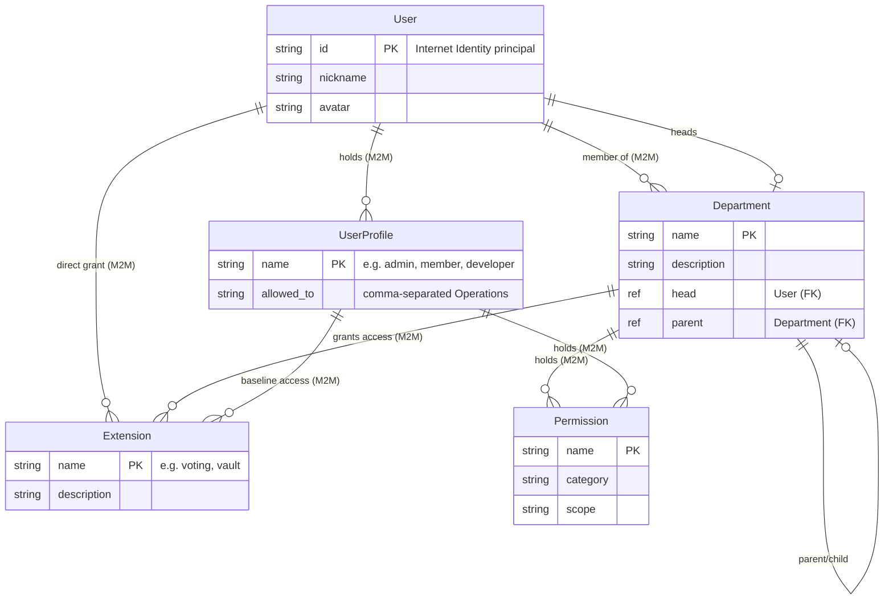
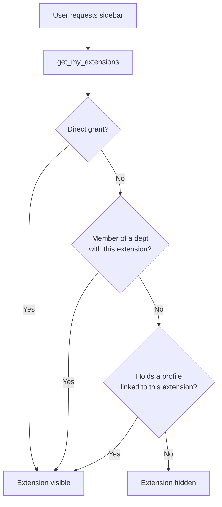
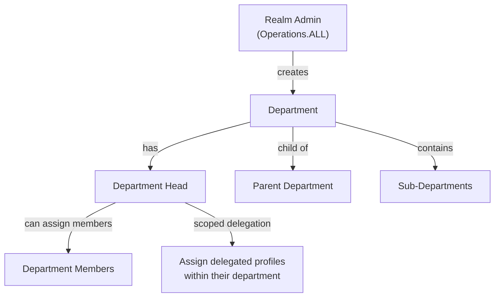
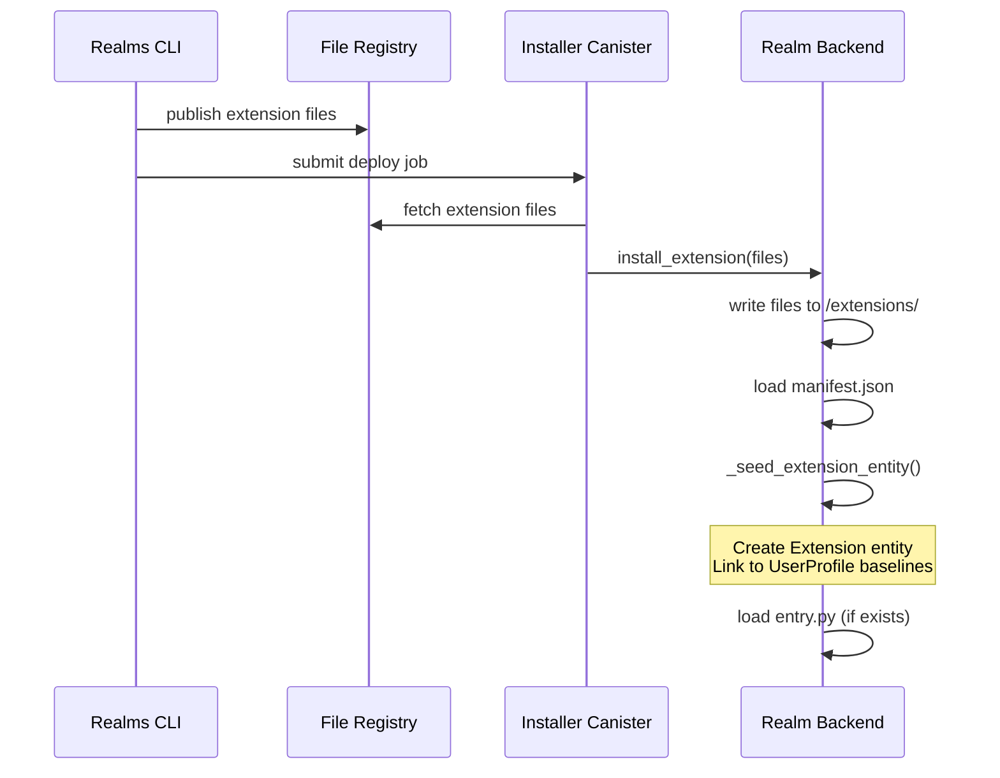

# Access Control Architecture

This document describes the entity relationship model for role-based access control (RBAC), department management, and dynamic extension visibility in Realms.

## Entity Relationship Diagram



## Extension Visibility Resolution

A user can see an extension if **any** of the following is true:



The formula is:

```
visible_extensions =
    user.extensions
    ∪ union(dept.extensions for dept in user.departments)
    ∪ union(profile.extensions for profile in user.profiles)
```

## Department Hierarchy & Scoped Delegation



Department heads can assign/revoke roles **only** if:
1. They are the `head` of the department, AND
2. The department has a `delegate:<profile_name>` permission

This enables scoped delegation without granting global `ROLE_ASSIGN`.

## Data Flow: Extension Installation



## Access Manager Extension

The `access_manager` extension provides a UI for managing all these relationships:

| Tab | Purpose |
|-----|---------|
| **Departments** | Create/delete departments, assign heads, manage members |
| **Extensions** | View/edit access grants per user, department, or profile |
| **Users** | View user access summary, assign/revoke profiles |

Accessible to users with `admin` or `user_manager` profiles.
