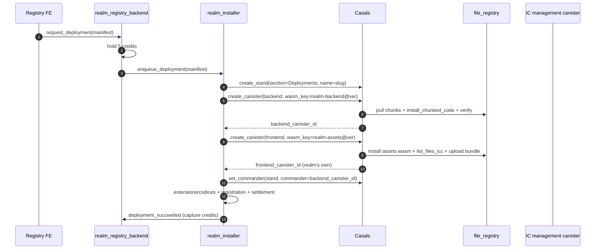

# Migration plan: adopt Casals as the canister-lifecycle engine

Status: proposed (planning). Owner: TBD. Last updated: 2026-06-06.

## Summary

Replace the Realms deployment stack — the on-chain `realm_installer` mechanics plus
the **off-chain** Realms Deploy Service (`realms-deployer` / `realms-management-service`) —
with [Casals](https://github.com/smart-social-contracts/Casals), an on-chain canister
lifecycle orchestrator.

Verdict from the feasibility analysis: a pure "Casals replaces everything" swap is
**not** possible without losing functionality, but a **two-layer** design is, and it
removes the off-chain deployer entirely:

- **Casals (engine):** create / install (`install_chunked_code` from `file_registry`) /
  verify `module_hash` / snapshot + all-or-nothing rollback / cycles / pool.
- **Realms orchestrator (thin):** keep `realm_installer` as its own canister, slimmed
  to a Casals client that retains the Realms domain steps (extensions, codices,
  registration, credit settlement, version catalog).

We are targeting the **fully on-chain** frontend variant (no off-chain deployer). Each
realm gets **its own** frontend (certified-assets) canister — full sovereignty, no
sharing — made practical by per-canister upload optimizations (see below).

## Locked decisions

- End state: two layers (Casals engine + thin Realms orchestrator).
- `realm_installer` stays a separate canister; it becomes a Casals client.
- Orchestra: two Sections — **Infra** (platform canisters) and **Deployments**
  (one Stand per realm). See "Orchestra organization" below.
- Tenancy: one realm -> one Casals **Stand**, under the **Deployments** Section.
- Frontend: **fully on-chain, one dedicated asset canister per realm** (no shared
  release). Casals uploads the whole bundle into each realm's own canister, optimized
  by a small image + batch-commit + incremental (changed-file-only) upgrades. The
  off-chain deployer is deleted.
- Billing (fiat -> credits) stays off-chain (unavoidable). It is the only off-chain
  service that remains.

## Orchestra organization (Realm-as-a-Service)

```
Orchestra
├── Section: Infra              # the platform's own canisters
│   ├── Stand: installer        # realm_installer
│   ├── Stand: registry         # realm_registry_backend (+ its frontend)
│   ├── Stand: file-registry    # file_registry (WASM + frontend-bundle store)
│   └── Stand: marketplace       # marketplace_backend, dashboards, …
└── Section: Deployments        # one Stand per realm (the RaaS tenants)
    ├── Stand: agora
    │   ├── Canister: backend    # realm_backend  (Stand commander)
    │   └── Canister: frontend   # realm's own certified-assets canister
    ├── Stand: syntropia
    │   ├── Canister: backend
    │   └── Canister: frontend
    └── Stand: <new realm> …
```

Each realm's Stand commander is its **backend** canister principal, so a realm can
self-upgrade (member vote -> backend -> `casals.upgrade_to`) without platform
involvement.

## What Casals already covers (safe to retire from the current stack)

- Canister creation + initial cycles (`create_canister`, CMC). Realms never implemented
  this (`allocate_deployment_canisters` is a Candid stub with no handler).
- Backend WASM install/upgrade fully on-chain via `install_chunked_code` pulled from
  `file_registry` -> removes `dfx canister install` and the whole off-chain worker.
- Module-hash verification, pre-upgrade snapshot + rollback + delete.
- Stop/start, controller management, canister pool reuse.
- Cycles: `top_up` / `reconcile` / `set_cycle_policy` / autopilot / sampling / history.

## What Casals does NOT cover (rehomed into the thin orchestrator, not deleted)

All in `src/realm_installer/main.py`:

- Extension install orchestration (`DeployTask`/`DeployStep` runner -> target
  `install_extension_from_registry`, with retries / partial handling / resume).
- Codex install (`install_codex_from_registry`).
- Realm registration (`schedule_registration`: `canister_ids.js`, `update_realm_config`,
  `set_canister_config`, `store_admin_invite_hash`, `register_realm`).
- `grant_frontend_access` (grant the realm backend `Commit` on its frontend).
- Credit hold/capture/release coupling in `realm_registry_backend`
  (`request_deployment` 5-credit hold, `deployment_succeeded`/`deployment_failed`).
- Version catalog (`publish_version` / `get_latest_version`) and `request_upgrade`.

## Delete vs. retain

### Deleted / retired
- Off-chain worker backend path in `realms-deployer/backend/app/services/deployment_worker.py`
  (poll loop, `_install_wasm` dfx install, dfx plumbing).
- Deploy-time backend artifact download from GitHub releases.
- Worker snapshot trigger + status callbacks (`take_pre_upgrade_snapshot`,
  `report_canister_ready`, `report_frontend_verified`).
- The off-chain deployer **entirely** (frontend goes on-chain too — see below),
  including the patched `assetstorage.wasm.gz` incremental-sync trick.
- `scripts/cycleops/` top-up scripts (Casals native cycles; optionally keep CycleOps
  as a secondary controller).
- Optionally the Mundus direct-dfx fleet path (`scripts/ci_install_mundus.py`).

### Retained
- `realm_registry_backend` — unchanged (credits, version catalog, `register_realm`,
  directory, `request_upgrade`).
- `realm_installer` — separate canister, slimmed to Casals-client + domain orchestrator.
- `file_registry` — retained, now also Casals' WASM **and** frontend-bundle source.
- `marketplace_backend` — unchanged.
- Off-chain **billing** service only.

### New
- Casals deployed as infra; sole controller of realm canisters; `Infra` + `Deployments`
  Sections; one Stand per realm.
- Per-realm on-chain frontend provisioning in Casals (a frontend WASM carries a
  `bundle_namespace`; Casals uploads that whole bundle into the realm's own canister).
- CI artifact-publish pipeline (backend WASM + frontend bundle -> `file_registry`,
  `add_authorized_wasm` in Casals, `publish_version` in registry).

## Frontend: fully on-chain, one dedicated canister per realm

### Sovereignty first

Every realm owns its **own** certified-assets canister. No bundle is shared between
realms. The whole static build is uploaded into each realm's frontend canister at
provision time. This costs more than sharing, but it is the price of full per-realm
sovereignty — accepted.

### Why this is practical now (measured)

A representative SvelteKit bundle (`realm_registry_frontend/dist`) is **5.0 MB / 67
files**, but **~4 MB is a single `background.png`**; the actual code is ~1 MB of small
files. The earlier on-chain `deploy_realm` (removed, see `ONCHAIN_REALM_DEPLOY.md`,
[realms#192](https://github.com/smart-social-contracts/realms/issues/192)) was slow
because it re-uploaded the whole bundle through a Python canister with **one
inter-canister message per file** (~140 messages, dominated by that image, re-certifying
per file). Three optimizations make a per-realm upload land in **~30–60 s** for a fresh
deploy and **seconds** for upgrades:

1. **Shrink the image (done).** The 4 MB `background.png` (1920×1280 truecolor) was
   re-encoded to a dithered 256-color PNG at 1600×1067 (~1.06 MB) — keeping the same
   `.png` path so no references change. Every file in the bundle is now < ~1.1 MB, so
   each fits in a single inter-canister `store` message and the per-file upload path
   works without chunking.
2. **Batch commit.** Use the asset canister's batch API (`create_batch` /
   `create_chunk` / `commit_batch`) so all files certify in a **single** commit instead
   of one `store` + certification per file.
3. **Incremental upgrades.** On a re-deploy, diff against the canister's current keys
   (or the `file_registry` `_meta.json` sha256s) and upload only changed files.

### How Casals does it (generic, not Realms-specific)

No new shared-release entity. A frontend (certified-assets) WASM in Casals' catalog
simply carries a `bundle_namespace` pointing at the `file_registry` namespace that
holds the whole build:

```python
class AuthorizedWasm(Entity):
    # … key, family, version, registry_path, wasm_hash, kind …
    bundle_namespace = String(default="")   # e.g. "frontend/realm-assets@1.4.0"
```

When Casals provisions a canister from such a WASM, asset provisioning uploads the
entire bundle into **that** canister (each deployment has its own):

```python
def _maybe_provision_assets(canister_id, w):
    if w.bundle_namespace:
        yield from _upload_bundle(canister_id, w.bundle_namespace)   # whole build -> this canister
    elif w.asset_path:
        yield from _provision_assets(canister_id, w)                 # single file (e.g. index.html)
```

`_upload_bundle` lists the namespace (`file_registry.list_files_icc`), grants Casals
`Commit` on the new asset canister, and uploads each file. The batch-API bindings
(`create_batch` / `create_chunk` / `commit_batch`) are the optimization that collapses
this into one certified commit. This capability is generic: any multi-instance dapp that
wants a sovereign per-instance frontend benefits, with no Realms-specific logic in
Casals.

Per-realm config (`canister_ids.js`: which backend to talk to) and branding are small
per-realm files written into the same canister, so nothing is resolved at runtime and
each realm is fully self-contained.

## End-to-end create flow (after)



## Upgrade flow (after)

Member vote -> realm backend (the Stand commander) calls `casals.upgrade_to`
(snapshot -> install -> verify; auto-revert on failure). For multi-quarter realms the
installer loops `upgrade_to` one quarter at a time with a health check between stages
(Casals provides the per-canister atomic primitive; the installer provides staging).

## Phased implementation

Suggested order: Phase 0 -> 3 -> 1 -> 2 -> 4 -> 5. Validate on `test`/`staging` first.

### Phase 0 — Provision and wire Casals
- Deploy `casals_backend` per env. Reuse the existing Realms `file_registry` via
  `set_settings {file_registry_canister_id}`.
- `create_section {name: "Realms"}`; fund the treasury; set cycle policy.
- Grant `realm_installer` rights to create stands/canisters + assign commanders
  (recommended: add it as a Casals controller; alt: open_access + section commander
  with `commander.assign`).

### Phase 1 — `realm_installer` becomes a Casals client
- Add `CasalsService` binding (`create_stand`, `create_canister`, `set_commander`,
  `upgrade_to`) (done).
- Add an opt-in `InstallerConfig` singleton + `set_casals_config` / `get_casals_config`
  (`provision_via_casals` flag, `casals_canister_id`, `casals_section`,
  `registry_principal`) so the new path is fully non-breaking — off when unset (done).
- Add the `provision_via_casals(job_id)` update: creates the Stand + backend/frontend
  canisters via Casals, sets the realm backend as Stand commander, then hands off to the
  existing domain tail (`_start_extensions_for_job` / `schedule_registration` ->
  `schedule_registry_settlement`). WASM keys come from `manifest.casals`
  `{section?, stand?, backend_wasm_key, frontend_wasm_key}` (done).
- Authorization: `provision_via_casals` is restricted to canister controllers
  (manual/admin trigger) or the configured `registry_principal` (registry -> installer
  trigger), since it spends Casals cycles and advances job state (done).
- Casals verifies module hashes during install, so the Casals path trusts them
  (`wasm_verified`/`frontend_wasm_verified`/`assets_verified = 1`) instead of the
  off-chain `report_canister_ready`/`report_frontend_verified` round-trips.
- Keep `DeployTask`/`DeployStep`, `schedule_registration`, `schedule_registry_settlement`,
  `_resume_in_flight`. The legacy off-chain callbacks stay until cutover (Phase 4).
- Backend self-upgrade: extend `realm_backend/api/upgrade.py` to call Casals directly.

### Phase 2 — Per-realm on-chain frontend in Casals (fully on-chain)
- Add `bundle_namespace` to `AuthorizedWasm`; `_upload_bundle(canister_id, namespace)`
  uploads a whole bundle into the realm's own asset canister (done — single-`store`
  path; `file_registry.list_files_icc` consumed).
- Optimize: shrink `background.png` (done — dithered 256-color PNG, ~1.06 MB, so every
  bundle file fits one `store` message); later add `create_batch`/`create_chunk`/
  `commit_batch` bindings (one certified commit) and incremental (changed-file-only)
  upgrades by diffing `file_registry` `_meta.json` sha256s.
- Per-realm `canister_ids.js` + branding written as small files into the same canister.
- Delete the off-chain deployer and the patched assetstorage WASM.

### Phase 3 — CI artifact-publish pipeline
- New CLI `realms files publish-release` (done): uploads `realm_backend.wasm.gz` to
  `wasm/<family>-backend/<version>` and the frontend `dist/` (per-file, incremental via
  sha256 diff) to `frontend/<family>-assets/<version>`; with `--casals` it authorizes
  the backend WASM and the certified-assets WASM (the latter carrying
  `bundle_namespace = frontend/<family>-assets/<version>`); with `--registry-backend`
  it calls `publish_version`.
- Wire this command into `deploy-files.yml` / `release.yml` in place of the
  GitHub-release upload + off-chain worker download.

### Phase 4 — Cutover and migrate existing realms
- Wire `casals_backend` id into `realm_registry_frontend/src/lib/config.js`,
  `canister_ids.json`, and the installer.
- Transfer each live realm canister's controller to Casals, then `register_canister`
  into its Stand (no redeploy needed).
- Delete dead off-chain paths + CycleOps scripts.

### Phase 5 — Quarters
- Reroute quarter auto-scaling (`ic.create_canister()` in the realm backend) through
  `casals.create_canister`.
- Add the staged per-quarter `upgrade_to` loop with health gating in the installer.

## Stage 2 (future) — parallel deployment workers

The default Casals execution model is sequential: a Basilisk method runs one
inter-canister call at a time (`yield`), so within a **single** target a bundle uploads
file-by-file and quarters upgrade one-by-one. That is fine for one realm, but at RaaS
volume the bottleneck is **many independent targets** queued behind one worker.

Feasible win: shard work across **multiple Casals worker canisters** (a worker pool).
Because the targets are independent, this parallelizes cleanly and the speed-up is real
and roughly linear in worker count for:

- many realms being created/upgraded concurrently (each realm -> a different worker);
- multi-quarter realms (each quarter's `upgrade_to` -> a different worker), with the
  installer still gating health between staged rounds.

It does **not** speed up a single canister's own bundle upload (that target is the unit
of serialization) — for that, the in-canister optimizations above (small image, batch
commit, incremental) are the levers.

Shape: a thin dispatcher Stand fans jobs out to N identical worker canisters (drawn from
the pool), each holding the same authorized-WASM catalog + `file_registry` pointer;
results reconcile back to the dispatcher. Defer until single-worker throughput is the
measured bottleneck.

## Operational rollout
See `CASALS_ROLLOUT.md` for the step-by-step, reversible runbook (deploy/confirm Casals,
fund the cycles treasury, configure settings, build the orchestra, publish a release,
configure + flag-flip the installer, pilot one realm, migrate existing realms, cutover,
rollback).

## Open items
- Finalize `file_registry` namespacing for the frontend bundle and the batch-upload
  chunk sizing.
- **Installer least-privilege (done):** Casals now lets a section commander holding
  `stand.create` / `canister.create` create stands + register canisters within its own
  section (generic feature), so the installer can run as the `Deployments` section
  commander instead of a full Casals controller.
- Add the batch-API bindings (`create_batch`/`create_chunk`/`commit_batch`) and the
  incremental-upgrade diff; current `_upload_bundle` uses the proven single-`store` path.
- Decide whether the generic per-instance frontend capability warrants its own Casals
  issue.
