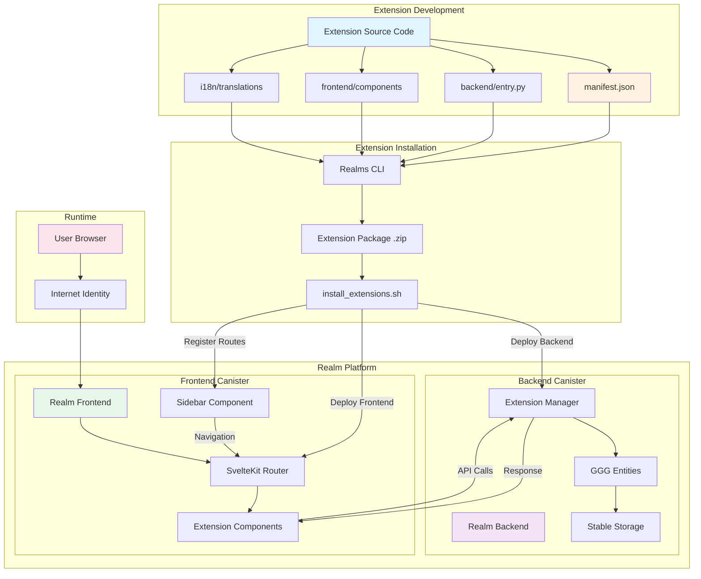
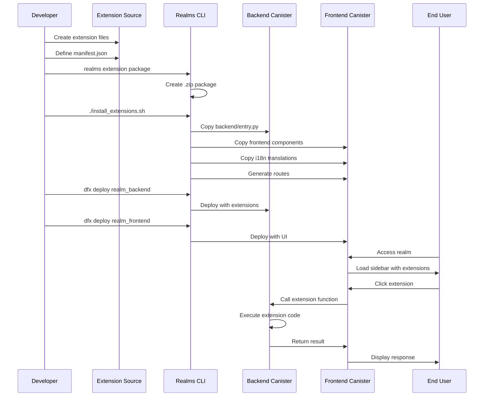
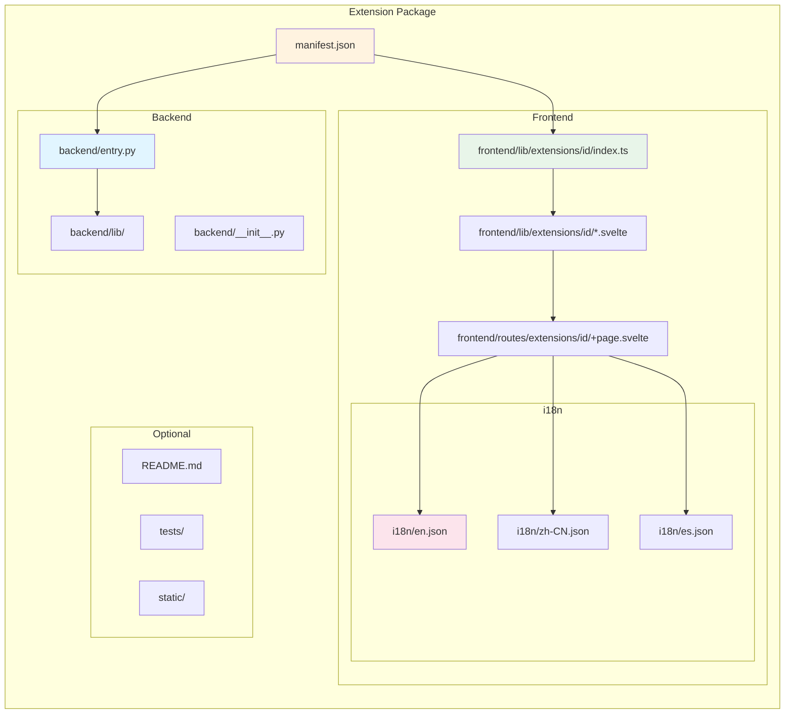
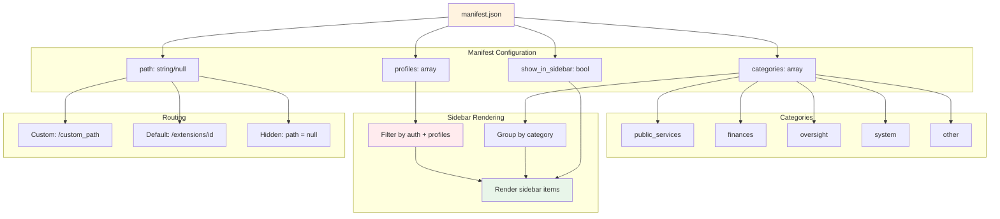
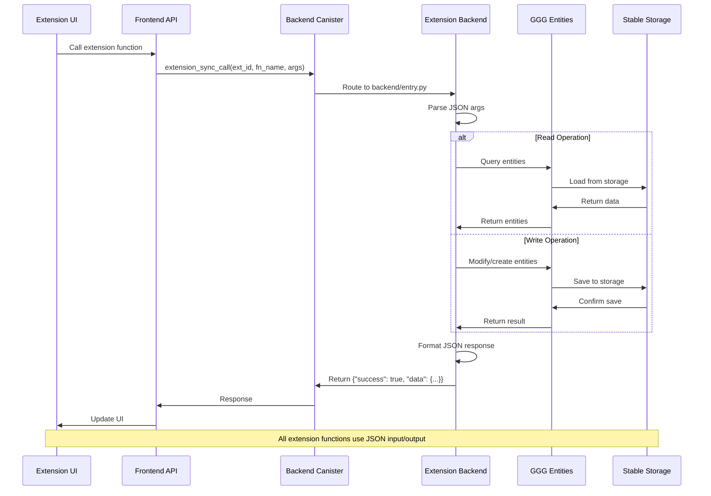
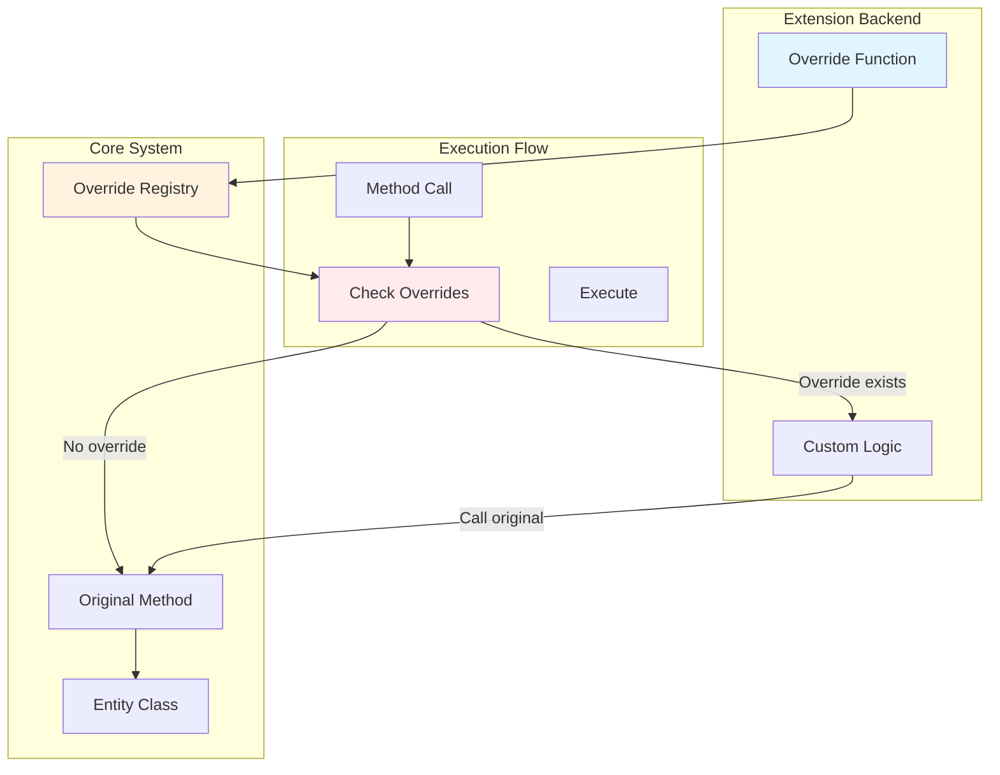

# Extension Architecture

## System Overview



## Extension Lifecycle



## Extension Structure



## Extension Categories & Routing



## Extension API Call Flow



## Method Override System



## Extension Permission Model

```mermaid
graph TD
    USER[User Request]
    AUTH{Authenticated?}
    PROF{Has Profile?}
    PERM{Has Permission?}
    
    EXT_PUB[Public Extension]
    EXT_MEM[Member Extension]
    EXT_ADM[Admin Extension]
    
    ALLOW[Allow Access]
    DENY[Deny Access]
    
    USER --> AUTH
    
    AUTH --> |No| EXT_PUB
    AUTH --> |Yes| PROF
    
    EXT_PUB --> ALLOW
    
    PROF --> |profiles: []| ALLOW
    PROF --> |profiles: [member]| PERM
    PROF --> |profiles: [admin]| PERM
    
    PERM --> |Match| ALLOW
    PERM --> |No Match| DENY
    
    style EXT_PUB fill:#e8f5e9
    style EXT_MEM fill:#fff3e0
    style EXT_ADM fill:#ffebee
    style ALLOW fill:#c8e6c9
    style DENY fill:#ffcdd2
```

## Extension Development Workflow

```mermaid
graph LR
    subgraph "1. Create"
        CREATE[Create Extension]
        STRUCT[Setup Structure]
        MANIFEST[Write manifest.json]
    end
    
    subgraph "2. Develop"
        BACKEND[Implement Backend]
        FRONTEND[Build Frontend]
        I18N[Add Translations]
        TEST[Write Tests]
    end
    
    subgraph "3. Test"
        LOCAL[Install Locally]
        DEPLOY[Deploy to Test Realm]
        DEBUG[Debug & Iterate]
    end
    
    subgraph "4. Package"
        PKG[Package Extension]
        DOC[Write Documentation]
        VER[Version & Tag]
    end
    
    subgraph "5. Distribute"
        RELEASE[Create Release]
        PUBLISH[Publish Package]
        MARKET[Add to Marketplace]
    end
    
    CREATE --> STRUCT
    STRUCT --> MANIFEST
    MANIFEST --> BACKEND
    
    BACKEND --> FRONTEND
    FRONTEND --> I18N
    I18N --> TEST
    
    TEST --> LOCAL
    LOCAL --> DEPLOY
    DEPLOY --> DEBUG
    DEBUG --> |Iterate| BACKEND
    
    DEBUG --> |Ready| PKG
    PKG --> DOC
    DOC --> VER
    
    VER --> RELEASE
    RELEASE --> PUBLISH
    PUBLISH --> MARKET
    %% MARKET = src/marketplace_* canister pair (Basilisk + SvelteKit).
    %% Files live in file_registry; the marketplace stores metadata
    %% pointers, likes, ranking, purchases, audit/verification status,
    %% and developer licenses. See docs/reference/MARKETPLACE.md.
    
    style CREATE fill:#e1f5ff
    style BACKEND fill:#f3e5f5
    style LOCAL fill:#fff3e0
    style PKG fill:#e8f5e9
    style MARKET fill:#fce4ec
```



## Key Concepts

### Extension Types
- **Public Extensions**: Accessible to all users (no profiles required)
- **Member Extensions**: Require authentication and specific profiles
- **Admin Extensions**: Restricted to admin profile only
- **System Extensions**: Core platform functionality

### Extension Categories
- **public_services**: Government services, citizen management
- **finances**: Treasury, payments, trading
- **oversight**: Dashboards, metrics, monitoring
- **system**: Admin tools, configuration
- **other**: General utilities

### Integration Points
1. **Backend Integration**: Extension functions callable via `extension_sync_call` or `extension_async_call`
2. **Frontend Integration**: Svelte components with routing and sidebar integration
3. **Entity Access**: Full access to GGG entity system
4. **Method Overrides**: Can intercept and modify entity method behavior
5. **i18n Support**: Multi-language translation system
6. **Storage**: Share realm's stable storage for persistence

### Security Model
- **Profile-based access control**: Extensions declare required profiles
- **Manifest validation**: CLI validates extension structure
- **Sandboxed execution**: Extensions run in canister environment
- **Input validation**: JSON schema validation for API calls

## Package Manager Extension

Realm administrators can install, update and uninstall both runtime
extensions and codex packages directly from the realm's frontend, without
re-deploying the WASM, by using the `package_manager` extension shipped
under `extensions/extensions/package_manager/`.

### What it does

The extension is an admin-only sidebar entry (profiles: `["admin"]`,
category: `other`) that wraps the existing realm_backend endpoints into
a three-tab UI:

| Tab        | What it does                                                                 | Backend calls                                                                 |
|------------|-------------------------------------------------------------------------------|--------------------------------------------------------------------------------|
| Installed  | Lists every runtime extension and codex package currently installed on the realm. Marks rows that have a newer version available in a connected registry. Offers Update / Reload (codex) / Uninstall. | `list_runtime_extensions`, `list_codex_packages`, `uninstall_extension`, `uninstall_codex`, `reload_codex`, plus `install_extension_from_registry` / `install_codex_from_registry` for updates |
| Browse     | For each `file_registry` canister this realm is linked to (`status().registries`), fetches `/api/extensions` and `/api/codices` and shows everything publishable. Cross-references with the installed list to show install / update buttons. | HTTP GET to `{registry}/api/extensions` + `{registry}/api/codices` (via `$lib/file-registry-client`), then `install_extension_from_registry` / `install_codex_from_registry` |
| Upload     | Lets the admin pick a folder of files (using `<input webkitdirectory>`) and pushes them in a single update call. Useful for one-off installs or local dev. Warns when the total payload exceeds the ~1.8 MB ICP ingress safe limit. | `install_extension({extension_id, files})` or `install_codex({codex_id, files, run_init})` |

### Permissions

All four mutating endpoints are gated by either `Operations.EXTENSION_INSTALL`
/ `Operations.EXTENSION_UNINSTALL` or `Operations.CODEX_INSTALL` /
`Operations.CODEX_UNINSTALL`. The default `ADMIN` profile (`Profiles.ADMIN`
in `src/realm_backend/ggg/system/user_profile.py`) is granted
`Operations.ALL` and therefore passes those checks. No new role wiring is
required for the package manager to work.

If you want a finer-grained role (e.g. a "package manager" sub-admin who
can install but not configure other parts of the realm), grant
`EXTENSION_INSTALL`, `EXTENSION_UNINSTALL`, `CODEX_INSTALL`, and
`CODEX_UNINSTALL` to a custom profile in `Profiles`.

### Sidebar live-reload

After every successful install / uninstall the extension dispatches a
`window` event (`realms:extensions-changed`). `Sidebar.svelte` listens for
this event and re-runs `get_sidebar_manifests()` so the new entry appears
immediately, without a full page reload.

### Caveats

- **Hot-loading**: backend extensions reload via `_load_module(force=True)`
  in `core/runtime_extensions.py`. Codex `init.py` runs synchronously inside
  the install update call, so a buggy `init.py` surfaces as the install
  response — the UI displays the `init_warning` field returned by the
  install call.
- **Frontend bundle**: a runtime extension's compiled UI is fetched from
  the file_registry the extension was installed from
  (see `extension-loader.ts`). After install the extension routes are
  available immediately, but the user may need to navigate to the new
  sidebar entry to mount the bundle.
- **Trust**: an admin can install arbitrary code from any registry the
  realm is linked to. There is no signature/checksum verification step in
  the runtime install path; if you need a "trusted publishers" gate, add
  it on top of `install_extension_from_registry` (the registry has an ACL
  for *publishing*, not for *consuming*).
- **Ingress limits**: ICP update calls have a ~2 MB ingress limit. The
  Upload tab warns when the total payload exceeds ~1.8 MB; for larger
  payloads, publish the extension to a `file_registry` and use the Browse
  tab instead — the registry-pull path uses inter-canister calls and
  isn't subject to the same limit.
