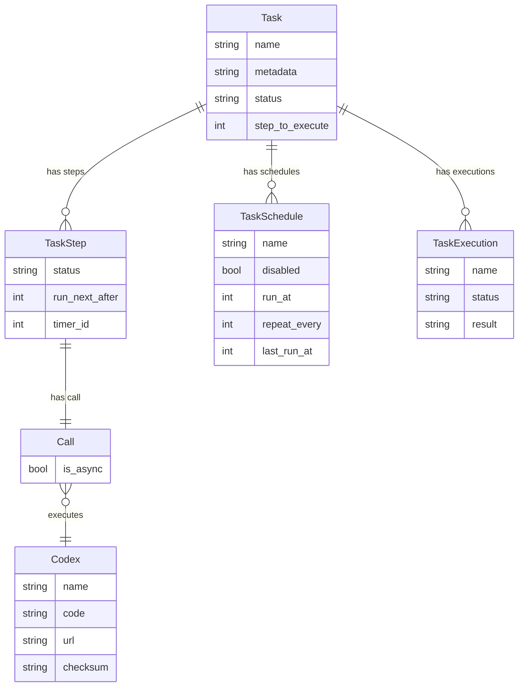
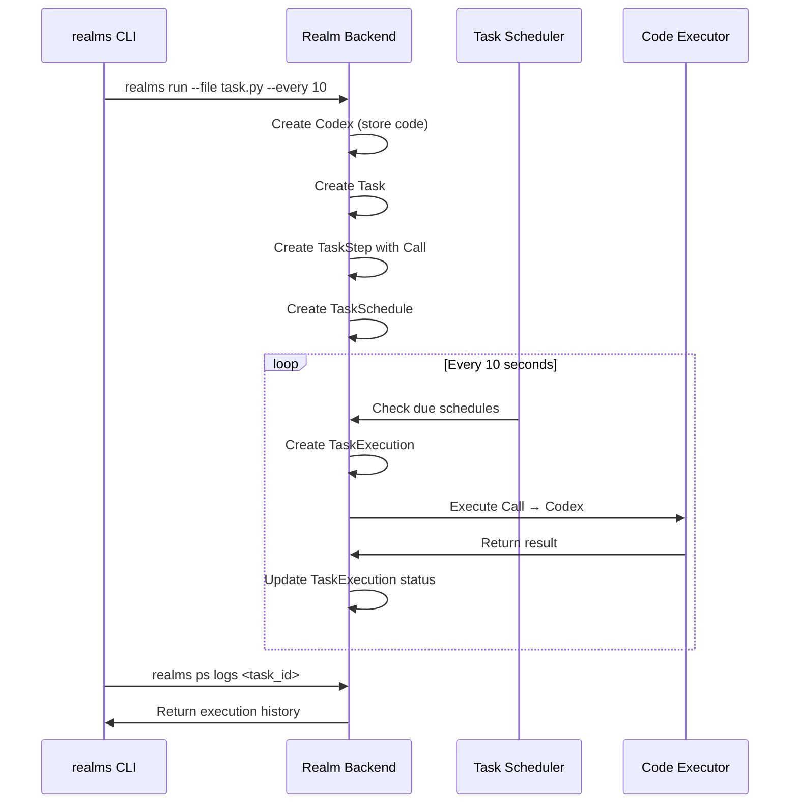

# Scheduled Tasks

Schedule Python code to run automatically at regular intervals on the Realms platform.

## Architecture Overview

The task scheduling system consists of several interconnected entities that work together to execute code on schedule.



### Entity Descriptions

| Entity | Description | GGG Standard |
|--------|-------------|--------------|
| **Task** | The main unit of work that can be scheduled and executed | ✅ Yes |
| **TaskStep** | A single step in a multi-step task (separates sync/async operations) | ❌ No |
| **TaskSchedule** | Schedule configuration for running a task at intervals | ❌ No |
| **TaskExecution** | Record of a task execution with status and result | ❌ No |
| **Call** | Links Codex code to a TaskStep for execution | ❌ No |
| **Codex** | Python code that can be stored, verified, and executed | ✅ Yes |

### Execution Flow



## CLI Reference

### Running Tasks

```bash
# Run a Python file once (immediate execution)
realms run --file examples/my_task.py

# Run every 10 seconds (scheduled task)
realms run --file examples/my_task.py --every 10

# Run after a 30-second delay
realms run --file examples/my_task.py --after 30

# Run with a multi-step config file
realms run --config task_config.json

# Specify network and canister
realms run --file task.py --network staging --canister realm_backend
```

### Managing Tasks (`realms ps`)

#### List Tasks

```bash
# List all scheduled and running tasks
realms ps ls

# Show detailed metadata
realms ps ls --verbose

# Output as JSON (for scripting)
realms ps ls --output json

# Specify realm folder
realms ps ls --folder .realms/my_realm
```

#### Start/Stop Tasks

```bash
# Start a stopped task
realms ps start <task_id>

# Stop a running task
realms ps kill <task_id>

# Task IDs can be partial (first 8 characters)
realms ps kill abc12345
```

#### View Logs

```bash
# View execution history (last 20 executions)
realms ps logs <task_id>

# Show last 50 executions
realms ps logs <task_id> --tail 50

# Follow logs in real-time (like tail -f)
realms ps logs <task_id> --follow

# Save logs to a file
realms ps logs <task_id> --output-file task.log

# Pagination for large log sets
realms ps logs <task_id> --limit 100 --from 0

# Output as JSON
realms ps logs <task_id> --output json
```

## Task Code Requirements

Tasks are defined as Python functions named `async_task()`.

### Sync Tasks (No Yield)

For simple operations that don't require inter-canister calls:

```python
def async_task():
    """Simple sync task - no inter-canister calls"""
    ic.print('Processing...')
    
    # Access GGG entities
    from ggg import User
    users = User.instances()
    ic.print(f'Found {len(users)} users')
    
    return 'ok'
```

### Async Tasks (With Yield)

For operations that require inter-canister calls (e.g., transfers, external API calls):

```python
def async_task():
    """Async task with inter-canister call"""
    from ggg import Treasury
    
    treasury = Treasury.instances()[0]
    
    # yield pauses execution until the async call completes
    result = yield treasury.refresh()
    
    ic.print(f'Treasury refreshed: {result}')
    return 'ok'
```

### Multi-Step Tasks

For complex workflows that need to separate sync and async operations:

```json
{
  "name": "complex_workflow",
  "steps": [
    {"codex": "step1_prepare.py", "async": false},
    {"codex": "step2_transfer.py", "async": true},
    {"codex": "step3_finalize.py", "async": false, "delay": 5}
  ],
  "schedule": {
    "every": 3600
  }
}
```

## Task State Storage

Tasks can store state between executions using `TaskEntity`:

```python
def async_task():
    """Task with persistent state"""
    
    # Define a task-scoped entity
    class ProcessingState(TaskEntity):
        last_processed_id = Integer(default=0)
        total_processed = Integer(default=0)
    
    # Get or create state
    states = ProcessingState.instances()
    if states:
        state = states[0]
    else:
        state = ProcessingState()
    
    # Process from where we left off
    from ggg import User
    users = User.filter(lambda u: int(u._id) > state.last_processed_id)[:100]
    
    for user in users:
        # Process user...
        state.last_processed_id = int(user._id)
        state.total_processed += 1
    
    ic.print(f'Processed {len(users)} users, total: {state.total_processed}')
    return 'ok'
```

## Related Documentation

- [Task Entity Implementation](./TASK_ENTITY.md) - TaskEntity for persistent state
- [Multi-Step Tasks](./MULTI_STEP_TASKS_IMPLEMENTATION.md) - Complex workflow implementation
- [CLI Reference](./CLI_REFERENCE.md) - Complete CLI documentation
- [API Reference](./API_REFERENCE.md) - Backend API endpoints
