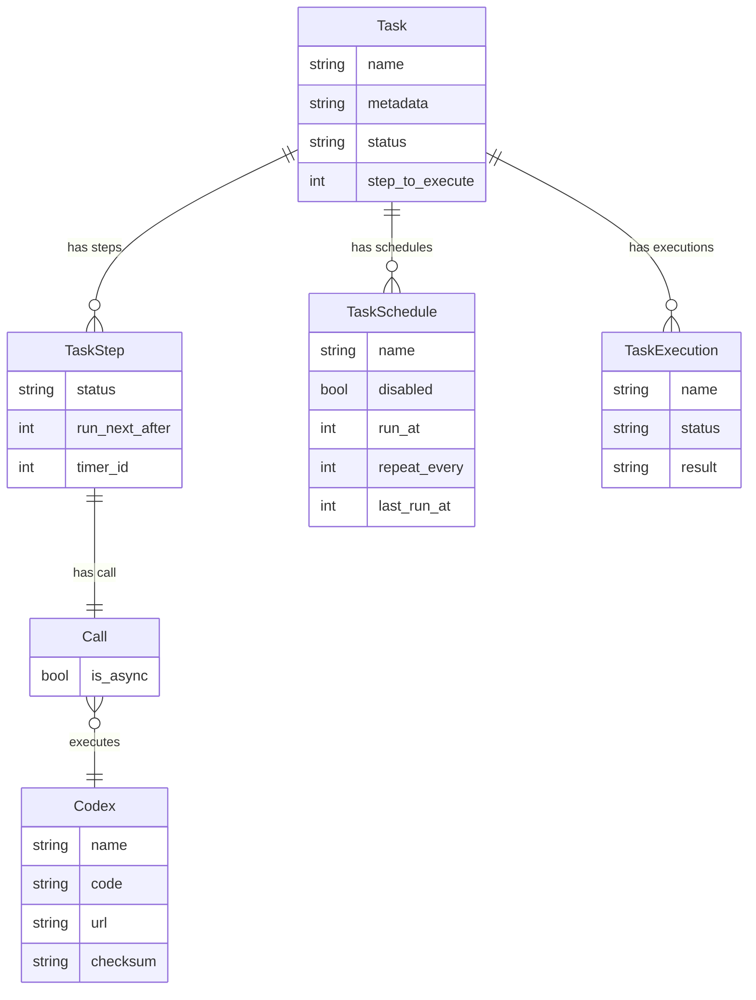
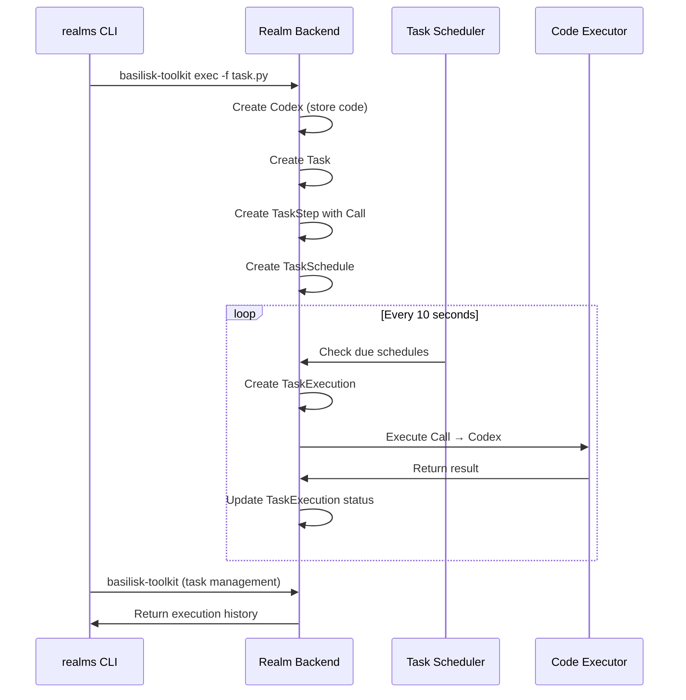

# Scheduled Tasks

Schedule Python code to run automatically at regular intervals on the Realms platform.

## Architecture Overview

The task scheduling system consists of several interconnected entities that work together to execute code on schedule.


```mermaid
erDiagram
    Task ||--o{ TaskStep : "has steps"
    Task ||--o{ TaskSchedule : "has schedules"
    Task ||--o{ TaskExecution : "has executions"
    TaskStep ||--|| Call : "has call"
    Call }o--|| Codex : "executes"
    
    Task {
        string name
        string metadata
        string status
        int step_to_execute
    }
    
    TaskStep {
        string status
        int run_next_after
        int timer_id
    }
    
    TaskSchedule {
        string name
        bool disabled
        int run_at
        int repeat_every
        int last_run_at
    }
    
    TaskExecution {
        string name
        string status
        string result
    }
    
    Call {
        bool is_async
    }
    
    Codex {
        string name
        string code
        string url
        string checksum
    }
```

### Entity Descriptions

| Entity | Description | GGG Standard |
|--------|-------------|--------------|
| **Task** | The main unit of work that can be scheduled and executed | ✅ Yes |
| **TaskStep** | A single step in a multi-step task (separates sync/async operations) | ❌ No |
| **TaskSchedule** | Schedule configuration for running a task at intervals | ❌ No |
| **TaskExecution** | Record of a task execution with status and result | ❌ No |
| **Call** | Links Codex code to a TaskStep for execution | ❌ No |
| **Codex** | Python code that can be stored, verified, and executed | ✅ Yes |

### Execution Flow


```mermaid
sequenceDiagram
    participant CLI as realms CLI
    participant Backend as Realm Backend
    participant Scheduler as Task Scheduler
    participant Executor as Code Executor
    
    CLI->>Backend: basilisk-toolkit exec -f task.py
    Backend->>Backend: Create Codex (store code)
    Backend->>Backend: Create Task
    Backend->>Backend: Create TaskStep with Call
    Backend->>Backend: Create TaskSchedule
    
    loop Every 10 seconds
        Scheduler->>Backend: Check due schedules
        Backend->>Backend: Create TaskExecution
        Backend->>Executor: Execute Call → Codex
        Executor->>Backend: Return result
        Backend->>Backend: Update TaskExecution status
    end
    
    CLI->>Backend: basilisk-toolkit (task management)
    Backend->>CLI: Return execution history
```

## CLI Reference

Code execution and task management are handled by `basilisk-toolkit`:

```bash
# Execute a Python file on the canister
basilisk-toolkit exec -f examples/my_task.py

# Interactive shell
basilisk shell

# Specify canister and network
basilisk-toolkit exec --canister my_app --network ic -f task.py
```

Task scheduling and management (creating recurring tasks, listing, starting, stopping, viewing logs) are provided by the `ic-basilisk-toolkit` package. See the basilisk-toolkit documentation for details.

## Task Code Requirements

Tasks must define a function called `async_task()`. The function name is always `async_task` regardless of whether your code is synchronous or asynchronous—the distinction is whether you use `yield` inside the function.

### Sync Tasks (No Yield)

For simple operations that don't require inter-canister calls, just write normal Python code without `yield`:

```python
def async_task():
    """Sync task - no yield, no inter-canister calls"""
    ic.print('Processing...')
    
    # Access GGG entities
    from ggg import User
    users = User.instances()
    ic.print(f'Found {len(users)} users')
    
    return 'ok'
```

### Async Tasks (With Yield)

For operations that require inter-canister calls (e.g., transfers, external API calls), use `yield` to pause execution until the call completes:

```python
def async_task():
    """Async task - uses yield for inter-canister calls"""
    from ggg import Treasury
    
    treasury = Treasury.instances()[0]
    
    # yield pauses execution until the async call completes
    result = yield treasury.refresh()
    
    ic.print(f'Treasury refreshed: {result}')
    return 'ok'
```

### Multi-Step Tasks

For complex workflows that need to separate sync and async operations:

```json
{
  "name": "complex_workflow",
  "steps": [
    {"codex": "step1_prepare.py", "async": false},
    {"codex": "step2_transfer.py", "async": true},
    {"codex": "step3_finalize.py", "async": false, "delay": 5}
  ],
  "schedule": {
    "every": 3600
  }
}
```

## Task State Storage

Tasks can store state between executions using `TaskEntity`:

```python
def async_task():
    """Task with persistent state"""
    
    # Define a task-scoped entity
    class ProcessingState(TaskEntity):
        last_processed_id = Integer(default=0)
        total_processed = Integer(default=0)
    
    # Get or create state
    states = ProcessingState.instances()
    if states:
        state = states[0]
    else:
        state = ProcessingState()
    
    # Process from where we left off
    from ggg import User
    users = User.filter(lambda u: int(u._id) > state.last_processed_id)[:100]
    
    for user in users:
        # Process user...
        state.last_processed_id = int(user._id)
        state.total_processed += 1
    
    ic.print(f'Processed {len(users)} users, total: {state.total_processed}')
    return 'ok'
```

## Related Documentation

- [Task Entity Implementation](./TASK_ENTITY.md) - TaskEntity for persistent state
- [Multi-Step Tasks](./MULTI_STEP_TASKS_IMPLEMENTATION.md) - Complex workflow implementation
- [CLI Reference](./CLI_REFERENCE.md) - Complete CLI documentation
- [API Reference](./API_REFERENCE.md) - Backend API endpoints
