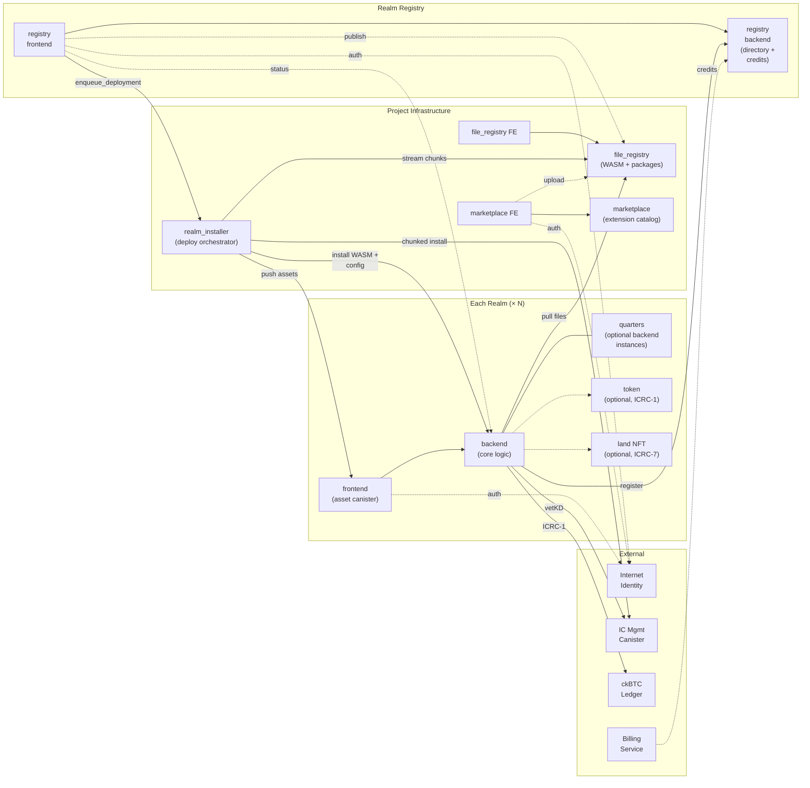

# Realms: Technical Introduction

## Overview

Realms is a **full-stack governance platform** built on the Internet Computer Protocol (ICP). It provides a complete framework for building decentralized governance systems with automated rule execution, transparent operations, and extensible functionality.

## Architecture

### Tech Stack
- **Backend**: Python (Basilisk) running on ICP canisters
- **Frontend**: SvelteKit + TypeScript with Tailwind CSS
- **Database**: On-chain key-value storage (Basilisk Simple DB)
- **Authentication**: Internet Identity
- **Blockchain**: Internet Computer Protocol

### Canister Diagram



The system is organized into four logical layers:

- **Realms** — each realm is a self-contained unit with its own frontend + backend canister pair, optional quarters (additional backend instances for horizontal scaling), and optional per-realm tokens (fungible ICRC-1 and land NFT ICRC-7).
- **Realm Registry** — central directory where all realms register themselves, plus a credit/billing ledger. The registry frontend also drives realm creation by coordinating with the installer.
- **Project Infrastructure** — shared services: `file_registry` (on-chain blob store for WASM/manifests/packages), `realm_installer` (timer-driven orchestrator for chunked WASM deploys), and `marketplace` (extension/codex catalog with listings and licenses).
- **External** — platform-level canisters and services not owned by the project: Internet Identity (auth), IC management canister (vetKD + chunked code install), ckBTC ledger, and an off-chain billing service.

### Core Components

**Realm Backend Canister** — Python-based business logic: entities, governance, finance, zones, extensions, vetKD crypto, and task automation. Each realm deploys its own instance.

**Realm Frontend Canister** — SvelteKit app served directly from blockchain. Connects to its realm backend and optionally to the file registry for extension bundles.

**Quarters** — Optional additional `realm_backend` instances that partition a realm for horizontal scaling. The frontend routes to the appropriate quarter by canister ID.

**Registry Backend** — Global realm discovery, registration, search, and credit ledger for billing. Realm backends self-register here on startup.

**File Registry** — On-chain file store for WASM blobs, extension/codex packages, and manifests. Serves files via both Candid (inter-canister) and HTTP.

**Realm Installer** — Orchestrates multi-step realm deployments: streams WASM chunks from the file registry, installs code via the IC management canister, configures the target backend, and pushes assets to the frontend canister.

**Marketplace** — Catalog for extensions, codices, and assistants with listings, licenses, and verification. Frontends bridge it to the file registry for uploads.

**Extension System** — Modular plugins for custom functionality with backend + frontend components.

## Key Features

### 1. Entity System (30+ Types)
Complete data model for governance:
- **Identity**: User, Human, Organization, Member
- **Governance**: Proposal, Vote, Mandate, Codex
- **Finance**: Treasury, Instrument, Transfer, Balance, Trade
- **Services**: Task, License, Dispute, Service
- **Registry**: Realm metadata and discovery

All entities inherit from base `Entity` class with CRUD operations, pagination, and query methods.

### 2. Task Automation
Execute Python code on schedule:
```python
from ggg import Task, Codex, User

codex = Codex(
    name="tax_collection",
    code="# Python code here"
)

task = Task(
    name="daily_taxes",
    codex=codex,
    schedule="0 0 * * *"  # Daily at midnight
)
```

**TaskEntity** - Persistent state storage for batch processing operations

### 3. Extension System
Build modular features with backend + frontend components:

```
extensions/{extension_id}/
├── manifest.json          # Metadata, permissions, categories
├── backend/
│   └── entry.py          # Python API endpoints
└── frontend/
    ├── index.ts          # TypeScript entry
    └── Component.svelte  # UI components
```

Extensions can override entity methods, add UI routes, and call backend functions.

### 4. CLI Tools
```bash
# Realm lifecycle
realms realm create --citizens 100 --organizations 10
realms realm deploy --network ic
realms import realm_data.json

# Task management
realms run codex.py
realms ps ls
realms ps logs <task_id>

# Extensions
realms extension install my_extension.zip
realms extension list
```

## Data Model Highlights

### Entity Base Class
```python
class Entity(StableEntity):
    @classmethod
    def instances(cls) -> List[Self]
    
    @classmethod
    def load_paginated(cls, start_id: str, limit: int)
    
    def save(self) -> Self
    def delete(self) -> None
```

### User Entity
```python
user = User(
    user_id="alice_123",
    principal="2vxsx-fae",
    profiles=["member", "admin"],
    status="active"
)
user.save()
```

### Treasury Operations
```python
# Get treasury balance
treasury = Treasury["main"]
balance = treasury.get_balance("realm_token")

# Create transfer
transfer = Transfer(
    from_user=User["alice"],
    to_user=User["bob"],
    instrument=Instrument["realm_token"],
    amount=100.0,
    status="completed"
)
```

## API Reference

### Backend Endpoints
```python
# Entity CRUD
GET  /api/entities/{entity_type}
POST /api/entities/{entity_type}
GET  /api/entities/{entity_type}/{entity_id}
PUT  /api/entities/{entity_type}/{entity_id}
DEL  /api/entities/{entity_type}/{entity_id}

# Task execution
POST /api/run_code
GET  /api/tasks
POST /api/tasks/{task_id}/execute

# Extension calls
POST /api/extension/{extension_id}/{function_name}
```

### Frontend API
```typescript
import { backendActor } from '$lib/canisters';

// Call backend
const users = await backendActor.list_users(1, 50);

// Extension call
const result = await backendActor.extension_sync_call(
    'admin_dashboard',
    'get_statistics',
    []
);
```

## Deployment Flow

```bash
# 1. Generate realm
realms realm create --random --citizens 100

# 2. Deploy canisters
cd generated_realm
dfx deploy --network ic

# 3. Upload data
realms import realm_data.json --network ic

# 4. Register (optional)
realms registry add --network ic
```

## Development Patterns

### Batch Processing with TaskEntity
```python
class BatchState(TaskEntity):
    __alias__ = "key"
    key = String()
    position = Integer()

# Process in chunks to avoid cycle limits
state = BatchState["main"] or BatchState(key="main", position=0)
batch = users[state.position:state.position + 100]
# ... process batch ...
state.position += 100
state.save()
```

### Method Override System
Extensions can override entity methods:
```python
# In extension backend/entry.py
def override_User_before_save(user, original_method):
    # Custom logic before save
    print(f"Saving user: {user.user_id}")
    return original_method(user)
```

### Async Task Execution
```python
from ggg import Task

async def async_codex():
    users = list(User.instances())
    for user in users:
        # Async operations
        await process_user(user)

# Task executes with async support
task = Task(name="async_task", codex=codex)
```

## Performance & Limits

**ICP Constraints:**
- Max instruction cycles per call: ~5B instructions
- Max message size: 2MB
- Solution: Use batch processing with TaskEntity

**Optimization Strategies:**
- Paginate large queries
- Use TaskEntity for stateful batch operations
- Implement incremental processing in tasks
- Cache frequently accessed data

## Security Model

**Authentication** - Internet Identity (WebAuthn-based)

**Authorization** - Profile-based access control (admin, member, etc.)

**Extension Permissions** - Declared in manifest.json

**Code Execution** - Sandboxed Python execution environment

## Next Steps

**Deploy Your First Realm:**
- [Deployment Guide](./DEPLOYMENT_GUIDE.md)
- [CLI Reference](./CLI_REFERENCE.md)

**Build Extensions:**
- [Extension Development Guide](../extensions/README.md)
- [Method Override System](./METHOD_OVERRIDE_SYSTEM.md)

**Understand the Data Model:**
- [Core Entities Reference](./CORE_ENTITIES.md)
- [API Reference](./API_REFERENCE.md)

---

**Learn More:** [Full Documentation](./README.md) | [GitHub Repository](https://github.com/smart-social-contracts/realms)
